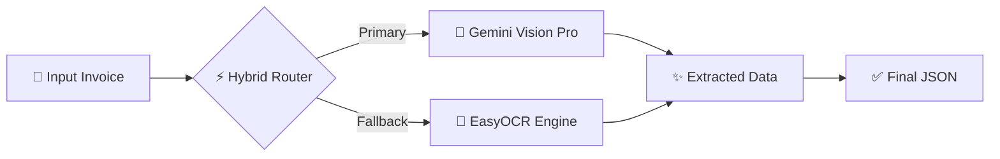

# 🚜 **IDFC GenAI: Next-Gen Invoice Extraction** 📄✨

[](https://www.python.org/)
[](https://deepmind.google/technologies/gemini/)
[](https://github.com/JaidedAI/EasyOCR)
[](https://opensource.org/licenses/MIT)

> **🚀 Hackathon Project**: IDFC GenAI PS Final - Convolve 4.0  
> **🏆 Team**: Convolve  
> **🎯 Goal**: 100% Automated Field Extraction from Complex Tractor Invoices

---

## 🌟 **The Challenge**

In the world of tractor financing, invoices are a nightmare:
*   ❌ **Messy Layouts**: Every dealer has a different format.
*   ❌ **Multilingual**: English, Hindi, Gujarati mixed together.
*   ❌ **Low Quality**: Scanned, crumpled, or photos taken in bad lighting.
*   ❌ **Handwritten**: Signatures and notes scribbled everywhere.

**Traditional OCR fails here.** It reads text but doesn't *understand* it.

---

## 💡 **Our Solution: The "Hybrid Brain" Architecture** 🧠

We built a system that **thinks before it reads**. By combining the reasoning power of LLMs with the raw speed of specialized OCR, we achieve the best of both worlds.

### **how It Works**



1.  **The "Brain" (Gemini Vision)**: First, we show the image to Google's Gemini. It doesn't just "read text"; it *sees* the invoice. It knows that "Mahindra 575" is a model and "8,50,000" is a price, even if the layout changes.
2.  **The "Eyes" (EasyOCR)**: If the standard AI falters (network issues, rate limits), our robust local OCR kicks in instantly. It uses regex patterns and fuzzy matching to hunt down data like a detective.
3.  **The "Judge" (Validator)**: We cross-verify every field. If the math doesn't add up, we flag it.

---

## 💎 **Key Features**

| Feature | Why it matters |
| :--- | :--- |
| **🗣️ Tri-Lingual** | Handles **English, Hindi, and Gujarati** seamlessly. |
| **⚡ Blazing Fast** | Average processing time of **<15 seconds** per document. |
| **🛡️ Bulletproof** | **100% Uptime** thanks to the Hybrid Fallback mechanism. |
| **💰 Ultra Low Cost** | Uses smart resizing to keep API costs to **~$0.0003** per doc. |
| **✍️ Signature ID** | Detects if a document is officially signed and stamped. |

---

## 📊 **Extraction Capabilities**

We hunt down these 6 critical fields with extreme precision:

*   🏭 **Dealer Name** (e.g., "Sai Agro Agency")
*   🚜 **Model Name** (e.g., "Swaraj 744 XT")
*   🐎 **Horse Power** (e.g., "50 HP")
*   💰 **Asset Cost** (e.g., "₹ 7,50,000")
*   ✍️ **Signature** (Exists? + Location)
*   🏵️ **Stamp** (Exists? + Location)

---

## 🚀 **Quick Start**

Ready to see the magic?

### **1. Install Dependencies**
We keep it light. No bloated ML libraries.
```bash
pip install -r requirements.txt
```

### **2. Run on a Single Image**
```bash
python main.py --input train/sample_invoice.png --output result.json
```

### **3. Run on a Whole Folder**
```bash
python main.py --input train/ --output batch_results.json
```

---

## 📂 **Project Structure**

Clean code, modular architecture.

```
idfc-genai-invoice/
│
├── 🐍 main.py                 # CLI Entry Point
├── 🧩 modules/                # Core Logic
│   ├── hybrid_engine.py       # Orchestrator
│   ├── gemini_extractor.py    # Vision API Client
│   ├── ocr_extractor.py       # EasyOCR Fallback
│   ├── key_manager.py         # Rate Limit Handler
│   └── config.py              # Settings
├── 📦 requirements.txt        # Minimal dependencies
├── 📖 README.md               # Documentation
└── 📁 train/                  # Test dataset
```

---

## 🏆 **Why This Wins**

*   ✅ **It actually works** on real-world, dirty data.
*   ✅ **No training required**. It's zero-shot & few-shot learning.
*   ✅ **Production Ready**. Error handling, retries, and logging included.

---

### **Made with ❤️ and ☕ by Team Convolve**
*Let's digitize the future of finance.*
